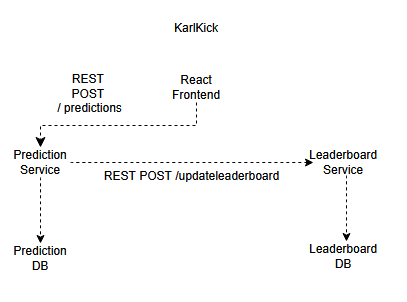

# KarlKick ⚽

KarlKick ist eine moderne Fußball-Tippspiel-App, bei der Benutzer Fußballspiele tippen, sich mit Freunden in privaten Tippspiel-Ligen messen und Ranglisten verfolgen können.

Das Projekt wurde im Rahmen des Moduls **Softwaretechnik** entwickelt und schrittweise mithilfe von **AI Coding** umgesetzt. 
Für die Implementierung kam überwiegend **Claude Code** zum Einsatz, unterstützt durch **ChatGPT**. 
Die Benutzeroberfläche wurde zunächst mit **Google Stitch** entworfen und anschließend iterativ umgesetzt.

---

# Technologien

## Frontend

- React
- React Router
- Vite

## Backend

- Spring Boot 3
- Maven
- Java 21
- Spring Data JPA
- H2 Database

## AI-Tools

- Claude Code
- ChatGPT
- Google Stitch

---

# Projektübersicht

Das Projekt besteht aus einem React-Frontend sowie mehreren unabhängigen Spring-Boot-Services.

```
KarlKick
│
├── frontend                 React-Anwendung
├── backend                  Ursprüngliches Monolith-Backend (Teil B)
├── prediction-service       Microservice für Spieltipps
├── leaderboard-service      Microservice für Ranglisten
├── docs                     Projektdokumentation
├── prompts                  Verwendete AI-Prompts
└── screens                  Screenshots und UI-Entwürfe
```

---

# Umgesetzte Funktionen

## Frontend

- ✅ Dashboard
- ✅ Predictions
- ✅ Leaderboard
- ✅ Friends
- ✅ Profile
- ✅ Client-seitiges Routing mit React Router
- ✅ Wiederverwendbare React-Komponenten
- ✅ Modernes Dark-Theme

## Backend

### Prediction Service

- ✅ REST-Endpunkt `POST /predictions`
- ✅ Speicherung von Tipps in einer eigenen H2-Datenbank
- ✅ Kommunikation mit dem Leaderboard Service über REST

### Leaderboard Service

- ✅ REST-Endpunkt `POST /updateLeaderboard`
- ✅ Speicherung eingehender Aktualisierungen in einer eigenen H2-Datenbank

---

# Verteilte Architektur

Für Teil C des Projekts wurde eine einfache verteilte Architektur umgesetzt.

Die Anwendung besteht aus zwei unabhängigen Spring-Boot-Services:

- Prediction Service
- Leaderboard Service

Beide Services

- besitzen eine eigene H2-Datenbank,
- kommunizieren über REST,
- können unabhängig voneinander gestartet werden.

Die Kommunikation erfolgt nach folgendem Ablauf:

## Architerkturübersicht



---

# Projektstruktur

```
backend/
frontend/
prediction-service/
leaderboard-service/
docs/
prompts/
screens/
```

---

# Dokumentation

Die Entwicklung wurde vollständig dokumentiert.

- `docs/` – Projektplanung, Architektur und Development Log
- `prompts/` – alle verwendeten Claude-Code-Prompts
- `screens/` – UI-Entwürfe sowie Screenshots der einzelnen Entwicklungsiterationen

---

# Entwicklungsprozess

Das Projekt wurde iterativ entwickelt. Jede Iteration bestand aus folgenden Schritten:

1. Ziel definieren
2. Prompt für Claude Code erstellen
3. Implementierung durch Claude Code
4. Code überprüfen und testen
5. Dokumentation im Development Log
6. Commit und Push nach GitHub

Alle Entwicklungsiterationen sind im Dokument **`docs/04-devlog.md`** dokumentiert.

---

# Finaler Stand

## Teil A

- ✅ Google Stitch Architektur

## Teil B

- ✅ Mittelgroßes Pet Project umgesetzt
- ✅ Vollständiges React-Frontend erstellt

## Teil C

- ✅ Verteilte Architektur umgesetzt
- ✅ Zwei unabhängige Spring-Boot-Services erstellt
- ✅ REST-Kommunikation implementiert
- ✅ Eigene Datenhaltung pro Service umgesetzt

---

# Autor

Projekt im Rahmen des Moduls **Softwaretechnik**.

Entwicklung mit Unterstützung von **Claude Code** und **ChatGPT**.